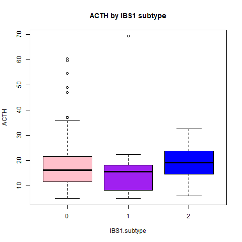

## AnalyzeACTH
### Single and multiple regressions, and scatterplots for clinical bloodwork and gene expression data.
([AnalyzeACTH.R](../AnalyzeACTH-master/scripts/AnalyzeACTH.R)) will allow you to load a RobinsonEtAl_Sup1 .csv with various datapoints, to perform single regressions of Body Mass Index (BMI) vs. ACTH from the Complete Blood Count with Differential (CBC-D) results, and to produce 2-D scatterplots and boxplots for the results. 

## ACTH
Adrenocorticotropic Hormone (ACTH) is a polypeptide tropic hormone produced and secreted by the anterior pituitary gland. In turn, this hormone causes the adrenal glands to make cortisol. The function of ACTH is to regulate the level of steroids hormone cortisol. ACTH test is used to determine diseases such as adrenal malfunction, lung tumor,and pituitary tumor.  

https://www.healthline.com/health/acth#procedure
Calhoun, S. (2017). ACTH Test. Healthline, 1.

## Install necessary packages
```
> install.packages("ggplot2")
> library(ggplot2)
```

## Assign "HIGH", "NORMAL", or "LOW" based on clinical range to the LDH_result parameter
##https://www.uptodate.com/contents/measurement-of-acth-crh-and-other-hypothalamic-and-pituitary-peptides
```
> IBS1$ACTH_result[IBS1$ACTH > 60] <- "HIGH"
> IBS1$ACTH_result[IBS1$ACTH <= 60 & IBS1$ACTH >= 10] <- "NORMAL"
> IBS1$ACTH_result[IBS1$ACTH < 10] <- "LOW"
> write.csv(IBS1, "data_output/ACTH_result.csv")
```

##
### Results of single regression, BMI x ACTH scatterplot
```
> ggplot(IBS1, aes(x=BMI, y=ACTH)) + geom_point() + geom_smooth(method=lm)
> png("fig_output/ACTH_single.regression scatterplot.png")
> ACTH_single.regression <- ggplot(IBS1, aes(x = BMI, y = ACTH)) + geom_point() + geom_smooth(method = lm) 
> print(ACTH_single.regression)

Call:
lm(formula = BMI ~ ACTH, data = IBS1)

Coefficients:
(Intercept)         ACTH  
    25.5406       0.0661  

```


##
## Results of single regression, BMI x ACTH boxplot
  
  ```
> ggplot(IBS1, aes(x=BMI, y=ACTH)) + geom_point() + geom_smooth(method=lm)
> png(fig_output/ACTH_boxplot.png)
> ACTH_single.regression <- ggplot(IBS1, aes(x = BMI, y = ACTH)) + geom_point() + geom_smooth(method = lm) 
> print(ACTH_single.regression)

Call:
lm(formula = BMI ~ ACTH, data = IBS1)

Coefficients:
(Intercept)         ACTH  
    25.5406       0.0661 
    
```    



### Gene Significance for ACTH

| Gene| Name|
|-----|-----|
| MT2A| Methallothionein 2A|
|USP9Y|Ubiquitin Specific Peptidase 9 Y-Linked|
| GUSB| Beta-Glucuronidase|
|ANGPTL4| Angiopoietin-like4|
